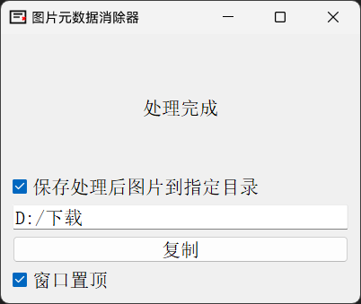

<h1 align="center">图片元数据消除器</h1>

    

图片元数据消除器是一个基于 PyQt5 开发的图形用户界面工具，旨在帮助用户轻松地从图片中移除所有元数据（如 EXIF、IPTC、XMP 信息），以保护隐私或减小文件大小。

该项目的代码主要由 `OpenAI o1-preview` 和 `OpenAI o1-mini` 编写，我提供了非常多的功能设计提议和反馈。

## 功能特性

- **批量处理：** 支持一次性处理多张图片，提升工作效率。
- **多种格式支持：** 支持 PNG、JPEG、GIF、BMP、TIFF 等常见图片格式。
- **移除所有元数据：** 支持移除图片中的所有元数据，包括 EXIF、IPTC、XMP 等。
- **图形用户界面：** 友好的界面设计，适合各类用户使用。
- **保存到指定目录：** 可选择将处理后的图片保存到自定义的文件夹。
- **复制到剪贴板：** 处理后的图片可直接复制到剪贴板，方便粘贴到其他应用程序。
- **窗口置顶功能：** 可选择让程序窗口始终保持在其他窗口之上，方便多窗口使用。

## 如何使用

1. **下载并运行：**
   1. 前往 [Releases](https://github.com/CookSleep/ImageMetadataRemover/releases) 页面
   2. 下载最新版本的 `ImageMetadataRemover.zip`。
   3. 解压 `ImageMetadataRemover.zip`。
   4. 双击运行 `图片元数据消除器.exe`。

3. **拖拽图片：**
   - 将需要处理的图片文件拖拽到程序窗口中，程序将自动开始处理。

4. **选择保存选项：**
   - 如果勾选了 “保存处理后图片到指定目录”，请在弹出的系统文件资源管理器窗口中选择目标文件夹，或是在关闭窗口后点击 “点击选择目录” / 文件夹地址 以重新选择目标文件夹，处理后的图片将自动保存到该位置。
   - 如果未勾选保存选项，处理后的图片将临时保存在系统的临时文件夹中，并允许用户按下 “复制” 复制文件到剪贴板，程序关闭后临时文件将被自动清除。

- **窗口置顶：**
   - 勾选 “窗口置顶” 选项，程序窗口将始终保持在其他窗口之上，方便多窗口使用。

## 贡献

欢迎对项目进行贡献！如果您有任何建议或想要添加新功能，请随时创建一个 Issue 或 Pull Request。

## 许可证

本项目采用 [GNU General Public License v3.0](https://www.gnu.org/licenses/gpl-3.0.html) 许可证，详情请见 [LICENSE](LICENSE) 文件。
