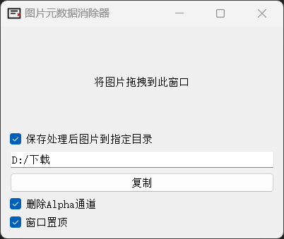

<h1 align="center">图片元数据消除器</h1>

    

图片元数据消除器是一个基于 PyQt5 开发的图形用户界面工具，旨在帮助用户轻松地从图片中移除所有元数据（如 EXIF、IPTC、XMP 信息），以保护隐私或减小文件大小。

该项目的代码主要由 `OpenAI o1-preview` `OpenAI o1-mini` 和 `claude-3-5-sonnet` 编写，我提供了非常多的功能设计提议和反馈。

## 功能特性

- **多种文件来源支持：** 支持拖拽本地、网络图片文件
- **高效并发处理：** 最多同时处理3张图片
- **智能格式处理：** 
  - JPEG/WEBP：使用piexif库处理
  - PNG：采用专门的数据块处理方法，精确移除元数据
  - 其他格式：通过图像数据重构方式移除元数据
- **友好的错误处理：** 
  - 详细的错误提示：通过弹窗显示具体的错误信息
  - 批量处理状态：显示成功/失败数量统计
  - 清晰的进度显示：实时显示处理进度
- **灵活的输出选项：** 
  - 自定义保存：可选择将处理后的图片保存到指定目录
  - 剪贴板复制：处理后的图片可直接复制到剪贴板
  - 保留原文件名：复制到剪贴板时保持原始文件名
- **便捷的界面功能：** 
  - 窗口置顶：可选择让程序窗口始终保持在最前
  - 状态反馈：使用不同颜色直观显示处理状态
  - 设置保存：自动记住用户的偏好设置

## 如何使用

1. **下载并运行：**
   1. 前往 [Releases](https://github.com/CookSleep/ImageMetadataRemover/releases) 页面
   2. 下载最新版本的 `ImageMetadataRemover.zip`
   3. 解压 `ImageMetadataRemover.zip`
   4. 双击运行 `图片元数据消除器.exe`

2. **添加图片：**
   将图片文件拖拽到程序窗口

3. **选择输出方式：**
   - **保存到目录：** 
     1. 勾选"保存处理后图片到指定目录"
     2. 点击"点击选择目录"或当前路径来选择保存位置
     3. 处理后的图片将自动保存到选择的目录
   - **临时处理：**
     1. 不勾选保存选项
     2. 处理后点击"复制"将图片复制到剪贴板
     3. 关闭程序后临时文件会自动清理

4. **其他选项：**
   - **窗口置顶：** 勾选"窗口置顶"使窗口保持在最前
   - **状态查看：** 通过状态栏颜色直观了解处理进度
     - 黑色：开始处理
     - 蓝色：处理中
     - 绿色：处理成功
     - 橙色：部分成功
     - 红色：处理出错

## 错误处理

程序会在以下情况显示错误提示：
- 保存目录不存在时
- 单个文件处理失败时
- 批量处理完成但有失败任务时

错误提示包含：
- 具体的错误文件
- 详细的错误原因

## 贡献

欢迎对项目进行贡献！如果您有任何建议或想要添加新功能，请随时创建一个 Issue 或 Pull Request。

## 许可证

本项目采用 [GNU General Public License v3.0](https://www.gnu.org/licenses/gpl-3.0.html) 许可证，详情请见 [LICENSE](LICENSE) 文件。
